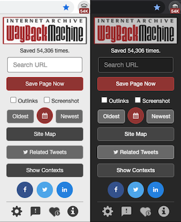

# Wayback Machine Web Browser Extension

In cooperation with [Google Summer of Code](https://summerofcode.withgoogle.com), The [Internet Archive](https://archive.org) presents *The Official WayBack Machine Extension*. With the power of the WayBack Machine, we let you go back in time to see how a URL has changed and evolved through the history of the Web!

## Features

- **Save Page Now** - Instantly save the page you are currently viewing in The WayBack Machine. Can auto-save pages that have yet to be archived.
- **Oldest, Newest, Overview** - View the first version of a page or the most recently saved in the Wayback Machine. Or view a calendar overview of all archived pages.
- **Sitemap** - Present a sunburst diagram for the domain you are currently viewing.
- **Related Tweets** & **Share Links** - Search Twitter for information regarding your current page. Share archived links on social media.
- **Show Contexts** - Provides a variety of information regarding the page you are viewing, including analytics from *Alexa*, capture summary from the Wayback Machine, annotations from *Hypothes.is*, and a word tag cloud.
- **404 Not Found** - Check if an archived copy is available if an error occurs while visiting a URL.
- **Wayback Count** - Display a count of pages that have been archived each time you visit a website.
- **Relevant Archived Resources** - Display archived resources on relevant URLs, including from Amazon books, Wikipedia, and various news sources. View digitized books and papers which are cited on the website, and present archived TV news clips relevant to the current page.

## Installing the Extension

Follow the steps below for the currently deployed version.

### Chrome

1. Go to our page on the [Chrome Web Store](https://chrome.google.com/webstore/detail/wayback-machine/fpnmgdkabkmnadcjpehmlllkndpkmiak).
2. Click the **Add to Chrome** button, then **Add extension**.
3. Click on the *Extensions* puzzle-like icon in the toolbar.
4. Now click on the **Pin** icon next to *Wayback Machine*.
5. Click on the newly added icon.
6. Read the terms, then *Accept and Enable*. Click on the icon again to use the extension.

### Firefox

1. Go to the [Firefox Add-Ons](https://addons.mozilla.org/en-US/firefox/addon/wayback-machine_new/) website.
2. Click **+ Add to Firefox**
3. Click on the newly added icon in the toolbar.

## Installing the Latest Build

Follow the steps below to install the latest build on your local machine.

- First tap on the **Clone** button, **Download ZIP**, then unzip the file in a location where you can find on your computer.

### Chrome

1. Open Chrome and navigate to [chrome://extensions](chrome://extensions) in your browser. You can also access this page by clicking on the 3 vertical dots menu on the top-right, hovering over **More Tools**, then selecting **Extensions**.
2. Turn on the switch next to **Developer mode**.
3. Click the **Load unpacked** button and select the `wayback-machine-chrome/webextension` directory that contains this code.
4. Click on the *Extensions* puzzle-like icon in the toolbar.
5. Now click on the **Pin** icon next to *Wayback Machine* to pin it.
6. Click on the newly added icon.
7. Read the terms, then *Accept and Enable*. Click on the icon again to use the extension.

See [What are extensions?](https://developer.chrome.com/extensions) for more information on Chrome extensions.

### Firefox

1. Open Firefox and navigate to [about:debugging](about:debugging) in the browser. You can also access this page by clicking on the hamburger menu on the top-right, select **Add-ons**, then the **Gear Tools button** on the top-right, then **Debug Add-ons**.
2. Click **This Firefox** on the left.
3. Click **Load Temporary Add-on...**
4. Open the `wayback-machine-chrome/webextension` directory and select any file.
5. Click on the newly added icon in the toolbar.
6. Read the terms, then *Accept and Enable*. Click on the icon again to use the extension.

See [Temporary installation in Firefox](https://extensionworkshop.com/documentation/develop/temporary-installation-in-firefox/) for more information on Firefox extensions.

## Provide Feedback

If you have a GitHub account, please check the [list of existing issues](https://github.com/internetarchive/wayback-machine-chrome/issues) (bugs are tagged red), then create a **New issue** to file a Bug report or Feature request.

## Testing

*This step is not required if you only want to try out the extension.*

To setup the testing environment, run `npm install` to install required packages.
This should create directory `node_modules` and populate it with modules.

To run tests, execute `npm test`.

When writing a test for `example.js`, create a new file in the test directory
named `example.spec.js`.

This has been tested using `node v10.11.0` and `npm 6.4.1`.

## Contributing Code

To contribute code and docs to Wayback Machine Chrome extension, take a look at our [Contribution Guide](CONTRIBUTION_GUIDE.md) and [Style Guide](STYLE_GUIDE.md).

## Credits

- Richard Caceres [@rchrd2](https://github.com/rchrd2)
- Rakesh Naga Chinta [@rakesh-chinta](https://github.com/rakesh-chinta)
- Abhishek Das [@abhidas17695](https://github.com/abhidas17695)
- Mark Graham [@markjgraham](https://github.com/markjgraham)
- Benjamin Mandel [@BenjaminMandel](https://github.com/BenjaminMandel)
- Anton Shiryaev [@Eagle19243](https://github.com/Eagle19243)
- Kumar Yogesh [@kumarjyogesh](https://github.com/kumarjyogesh)
- Vangelis Banos [@vbanos](https://github.com/vbanos)
- Kerry Rodden [@kerryrodden](https://github.com/kerryrodden)
- Max Reinisch [@MaxReinisch](https://github.com/maxreinisch)
- Anish Kumar Sarangi [@anishsarangi](https://github.com/anishsarangi)
- Pushkit Kapoor [@tikhsuP](https://github.com/tikhsuP)
- Carl Gorringe [@cgorringe](https://github.com/cgorringe)

## License

Copyright © 2017-2020 Internet Archive. All rights reserved.

Licensed under the the terms of the [GNU Affero General Public License version 3 (AGPLv3)](LICENSE).
